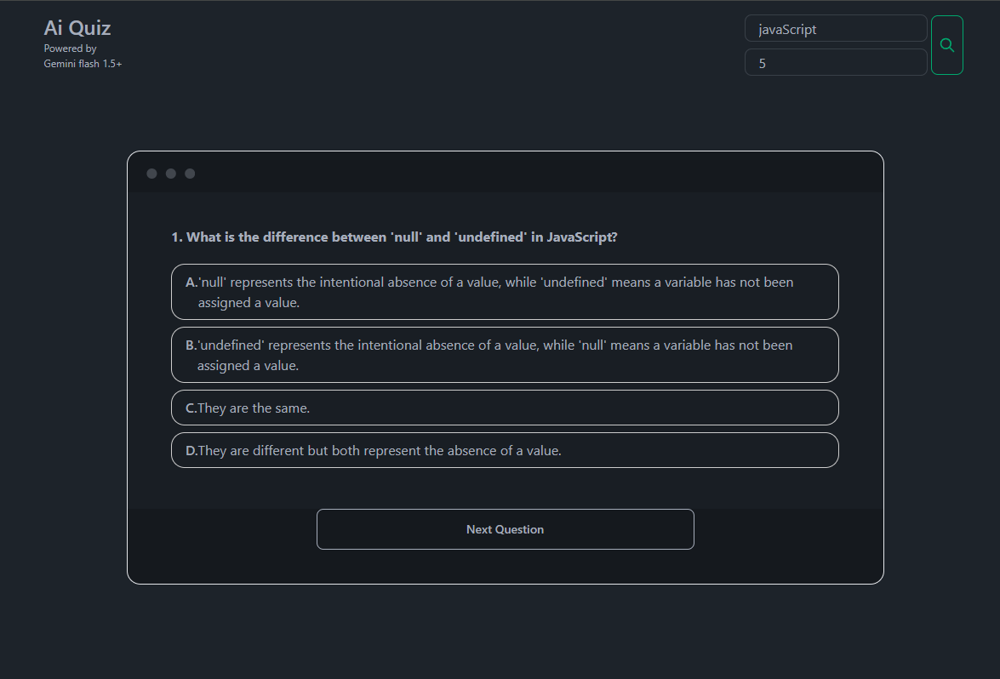
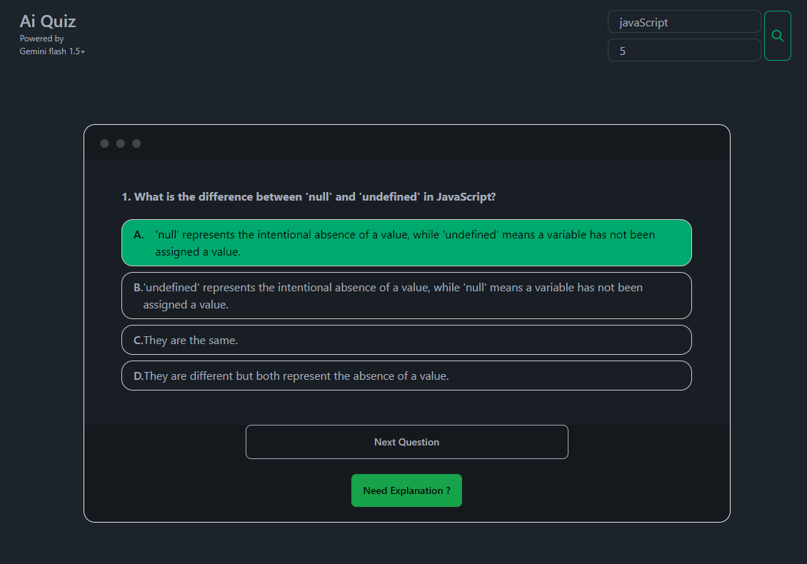
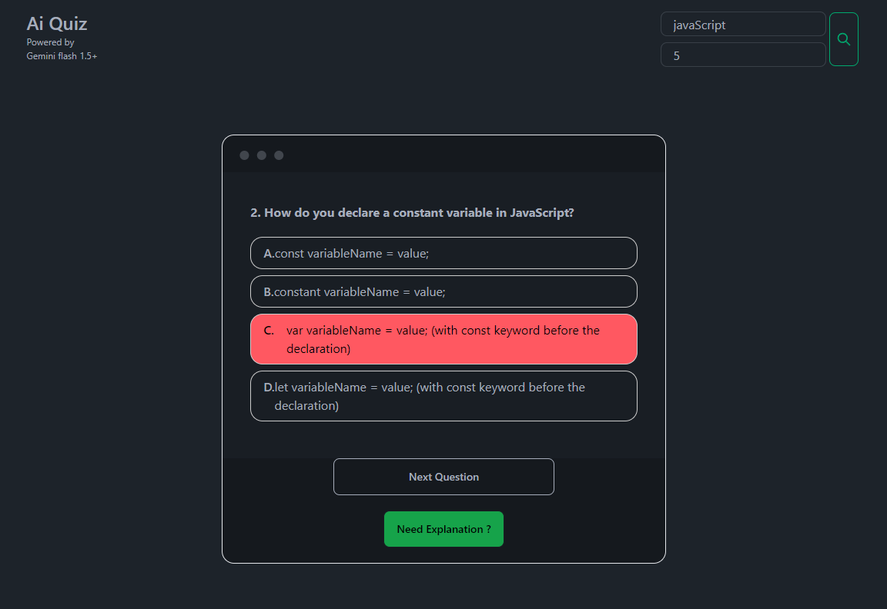
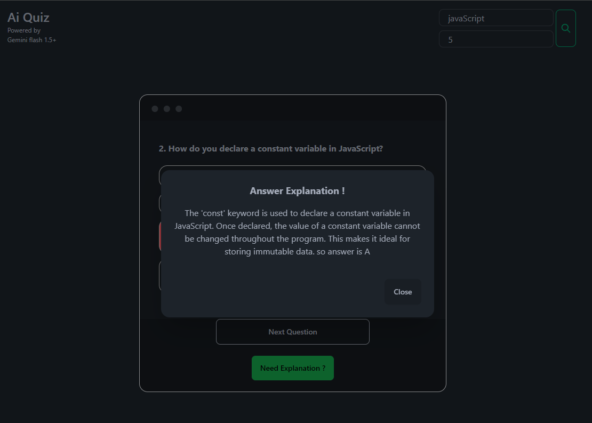

# BrainWave Ai Quiz

**BrainWave Ai Quiz** is an interactive quiz application powered by Gemini AI, designed to provide an engaging and intelligent quiz experience. The app offers a dynamic and responsive user interface, enabling users to test their knowledge across various domains with AI-generated questions.

## Features

- **AI-Powered Quizzes**: Leveraging Gemini AI to generate and evaluate quiz questions.
- **Responsive Design**: Optimized for both mobile and desktop devices.
- **Real-time Feedback**: Instant scoring and feedback on user answers.
- **Customizable Quizzes**: Users can select different categories and difficulty levels.
- **User-Friendly Interface**: Simple, intuitive, and interactive UI.

Note : There a one small bug which intentionally there and not fixed 

## ScreenShots
Start

Correct Answer

Wrong Answer

Explanation

## Installation

To run this project locally, follow these steps:

1. **Clone the Repository:**
   ```bash
   git clone https://github.com/AdityaBhojane/BrainWave_Ai-Quiz.git

   cd BrainWave_Ai-Quiz

   npm install
    ```
2. Add your environment variables in a .env file at the root of the project.
    ```
    npm run dev

    ```

## Folder Structure 
```bash
BrainWave_Ai-Quiz/
├── public/               # Public assets
├── src/                  # Source files
│   ├── components/       # React components
│   ├── context/          # Context API setup
│   ├── pages/            # Application pages
│   ├── utils/            # Utility functions
│   └── App.jsx           # Main App component
├── .env                  # Environment variables
├── .gitignore            # Git ignore rules
├── README.md             # Project documentation
├── package.json          # Node.js dependencies and scripts
├── vite.config.js        # Vite configuration
└── tailwind.config.js    # Tailwind CSS configuration
```

### Contributing
Contributions are welcome! Please fork this repository and submit a pull request with your changes.

## Acknowledgements
- Gemini AI for powering the intelligent quiz generation.
- Vite and React for providing a robust and fast development environment.
- Tailwind CSS for the beautiful and responsive design.